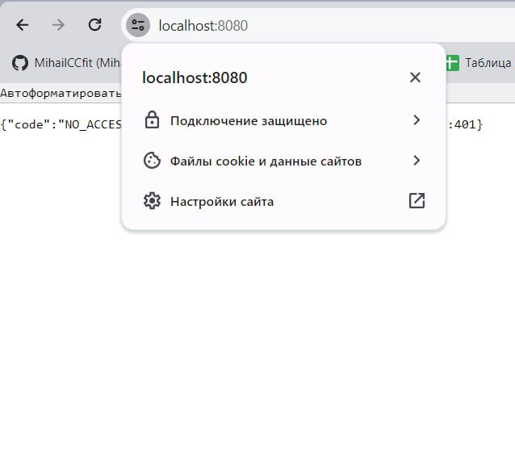
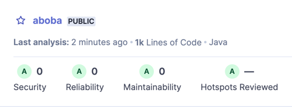
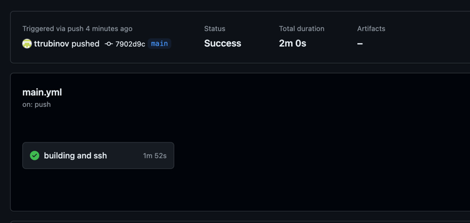
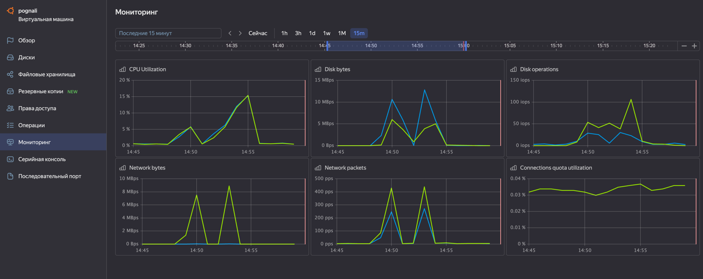
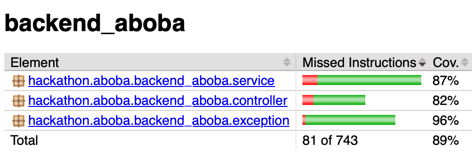

# ABOBA

## Security

### Аутентификация
Настроена первичная аутентификация через Яндекс ID 
Oauth-токены, после чего выдаются JWT-токены (access и refresh) и последующая
аутентификация проходит через них. JWT-токены хранятся в базе в хешированном виде.

### HTTPS
Настроена генерация SSL ключей, запросы проходят только по HTTPS.

Обеспечена безопасность и для внутренних систем, Prometheus аутентифицируется в бэкенде

## Style
Проходит *SonarQube* Style-check:

## CI/CD
Настроена автоматическая сборка докер-контейнера и
его деплой с помощью Github Actions на виртуальную машину Yandex Cloud,
поставка секретов происходит через Github Secrets

## Мониторинги
Данные поставляются через Prometheus в Grafana, которая уже отображает графики

## Тесты
Покрытие тестами - 89% (измерено с помощью Jacoco)

### Нагрузочное тестирование

